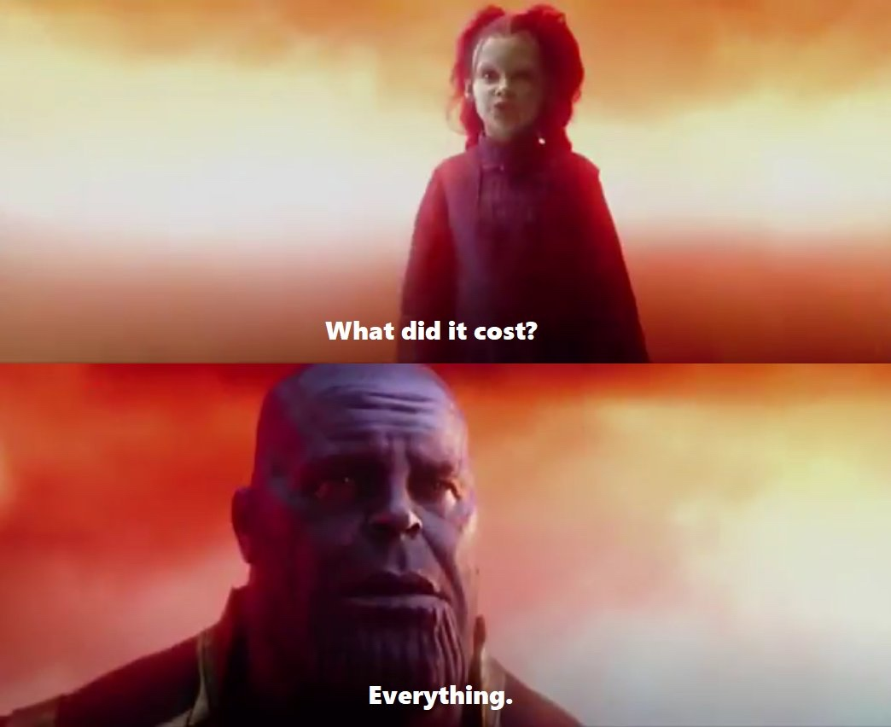

Well... Hello again! You guys were probably wondering where I've been and the truth is I've been busy. 
Since Mental Health is a pretty hot topic right now, guess there's no better time than now to open myself and vent for a bit. 

####**Contextualizing my life**

A regular day in my life goes something like this:  
- Wake up at 06:00
- Have a smoke before brushing my teeth + shower
- Smoke 2 darts before catching the bus
- Walk to the convinience store (that's 2 more ciggaretts)
- Buy my daily supply of Monster and Cup Noodles
- Walk to the office while smoking another cig and drinking a can of Red Bull
- Clock in at 07:30
- Crack open my morning Monster (Peach Rehab) and get my Snus on
- At 13:00 I'll have my lunch, which consists in a can of Monster Ultra
- Work
- Leave work at around 21:30
- Smoke 5 more ciggaretts before finally arriving at my appartment around 22:40
- Shower
- Eat my chicken Cup Noodles while writing my To-Dos for the next day
- Work on some side-project till 02:00 before going to bed and doing it all over again 

####**Why do I put myself through that?**

Honestly? I like it... Neigh, I LOVE IT! 
I love being in the office, I love coding, I love the feeling of being an important member of a team... 
I love being... **Useful**. 
Weekends, Holidays and Vacations (what the fuck are those) are the bane of my life. The mere idea of not working makes my skin crawl. 
When, rightfully so, my coworkers or my PM complain that I'm pushing fixes or online on Slack at 3am on a Sunday, I interpret it as a good thing and not some sicklly obsession. 
I don't care about promotions, praise or money. I want to work. 

####**What's the price of doing what I do?**

 

It goes without saying that I don't have a good social life (or one at all). 
My "friends" are my coworkers, but they only exist on Slack or during work hours. 
Family? Well, they haven't been around for a while so it doesn't really matter here. 
Relationships? HAHAHAHA... 
Physical Health? Could be better but other than insomnia, IBS and being underweight, I'm pretty okay. 
Mental Health? It's garbage. But you won't catch me admiting that. Most of it is a carry-over from years back, and I like to think that's the case. 

